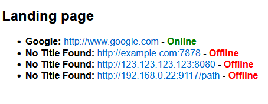

# php-site-status

Simple checker in php that use cURL to see if a webservice is available, also acts as a landing page/portal to said service/services.

Add URLs to the array:

```php
        // Array of URLs to check
        $urls = [
            "http://www.google.com",
            "http://example.com:7878",
            "http://123.123.123.123:8080",
            "http://192.168.0.22:9117/path",
            // Add more URLs as needed
        ];
```

Example of rendered page:

